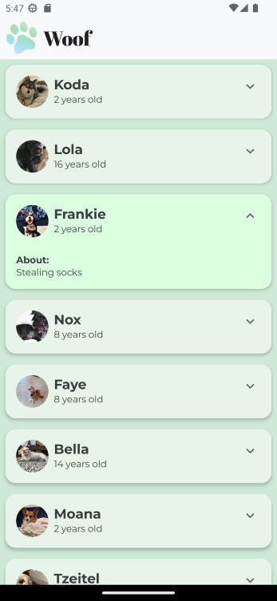
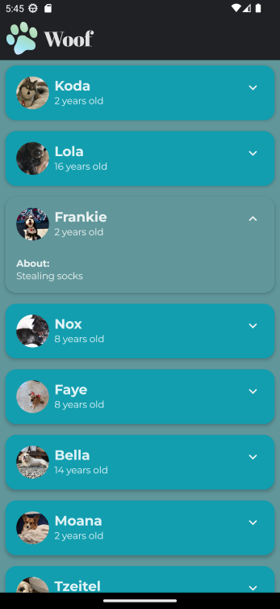

# Woof App - Compose

## App Description
An Android app that displays a list of of dogs and their information.

## Codelab from developer.android
* **Codelab: 2) Material Theming with Jetpack Compose**
    * This is a Walk through Codelab
* **Codelab: 3) Simple Animation with Jetpack Compose**
    * This is a Walk through Codelab
* **Codelab: 4) Testing for Accessibility**
    * This is a Walk through Codelab

## Solution in github
* Codelab: 2) Branch material
    * https://github.com/google-developer-training/basic-android-kotlin-compose-training-woof/tree/material
* Codelab: 3) Branch main
    * https://github.com/google-developer-training/basic-android-kotlin-compose-training-woof/tree/main

## Objective
* Material Theming
    * Follow design specification from the designer, detailing the visual design of the app in both light theme and dark theme.
* Spring animation with Jetpack Compose. Expand Icon
* animate*AsState Animation
* Use custom fonts
    * Add font resource directory
* Use custom color palette
* Use custom shapes to elements
* Add a top app bar.
* Expandable Click Cards
* Get App to display in Dark and Light mode

## Notes
* Used a data class to create a Record/object
* Used data > DataSource.kt - an array records/objects
* User a scrollable list.
* Use material design card
* Use Scaffold for appbar

## ANDROID BASICS WITH COMPOSE - Unit 3:  Display lists and use Material Design - Pathway 3: Build beautiful apps
Link: https://developer.android.com/courses/pathways/android-basics-compose-unit-3-pathway-3

## Codelab Screenshot

  
  

ref: woof-app-android-kotlin-compose

#appwoof #scrolllist #icon #materialDesign #topbar
#datasource #lazycolumn 
#card #codelab #fonts #addfonts
